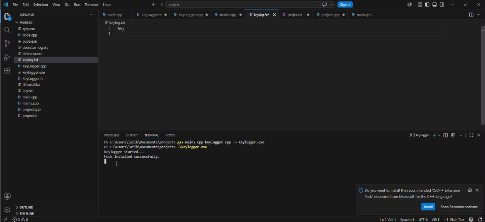
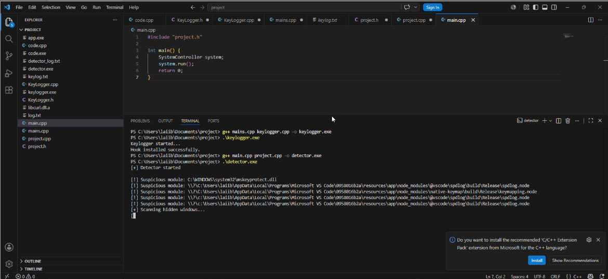

# Keyboard Hook Detection System

> A Windows-based cybersecurity project developed in C++ that demonstrates both keyboard event capture and defensive detection of suspicious keyboard hook activity using the Windows API.

---

## Overview

The **Keyboard Hook Detection System** is an educational cybersecurity project developed as part of the **Object-Oriented Programming (OOP)** course at **Air University**.

The project consists of two integrated modules:

- **Educational Keylogger** – demonstrates how low-level keyboard hooks can capture keyboard events.
- **Keyboard Hook Detector** – monitors the system for applications exhibiting suspicious keyboard hook behavior.

Rather than focusing solely on offensive techniques, this project explores **both attack and defense**, helping students understand how keyboard hooks work and how defensive software can identify potentially malicious behavior.

The project also demonstrates the practical application of **Object-Oriented Programming** concepts together with the **Windows API** to build modular, system-level applications.

---

## Features

### Educational Keylogger

- Captures keyboard input using Windows low-level keyboard hooks
- Logs keystrokes into a text file
- Handles common keyboard events
- Demonstrates Windows message loop implementation
- Object-oriented implementation using classes

### Keyboard Hook Detector

- Detects applications using suspicious keyboard hook mechanisms
- Monitors running processes
- Demonstrates defensive monitoring concepts
- Provides real-time console output
- Helps illustrate how security software can identify suspicious activity

---

## Technologies Used

- C++
- Windows API (Win32)
- Visual Studio
- Object-Oriented Programming
- Windows Hook Mechanism
- File Handling

---

## Object-Oriented Programming Concepts

The project was designed using several fundamental OOP principles, including:

- Classes and Objects
- Encapsulation
- Abstraction
- Constructors
- Static Members
- Modular Class Design
- Separation of Interface (.h) and Implementation (.cpp)

---

## Windows API Functions Used

This project utilizes several Win32 API functions, including:

- SetWindowsHookEx()
- UnhookWindowsHookEx()
- CallNextHookEx()
- GetMessage()
- TranslateMessage()
- DispatchMessage()
- GetAsyncKeyState()
- GetModuleHandle()
- GetLastError()

These APIs enable low-level keyboard hook installation, event processing, and interaction with the Windows operating system.

---

## Repository Structure

```
Keyboard-Hook-Detection-System/

├── Keylogger/
│   ├── main.cpp
│   ├── KeyLogger.cpp
│   ├── KeyLogger.h
│
├── HookDetector/
│   ├── main.cpp
│   ├── Detector.cpp
│   ├── Detector.h
│
├── screenshots/
│   ├── keylogger-demonstration.png
│   ├── detector-running.png
│   ├── detector-output.png
│
├── KeyLogger-Report.pdf
├── HookDetector-Report.pdf
├── README.md
├── LICENSE
└── .gitignore
```

---

## Demonstration

### Educational Keylogger

The keylogger demonstrates how keyboard events can be intercepted using Windows low-level keyboard hooks. Keystrokes entered in a controlled environment are recorded into a log file to illustrate how keyboard monitoring software operates.

### Keyboard Hook Detector

The detector scans for applications exhibiting keyboard hook behavior and demonstrates how defensive monitoring techniques can help identify potentially suspicious processes.

---

## Screenshots

### Educational Keylogger



### Keyboard Hook Detector



### Detection Output


---

## Project Documentation

This repository includes complete project documentation describing the design, implementation, Windows API usage, OOP concepts, testing methodology, limitations, and future improvements.

- KeyLogger-Report.pdf
- HookDetector-Report.pdf

---

## Learning Outcomes

Through this project, we gained practical experience in:

- Object-Oriented Programming
- Windows API Programming
- Low-Level Keyboard Hooks
- Process Monitoring
- File Handling in C++
- Windows Message Loop
- System Programming
- Defensive Cybersecurity Concepts
- Secure Software Design

---

## Future Improvements

Possible future enhancements include:

- GUI-based interface
- Encrypted log storage
- Timestamped keystrokes
- Active window monitoring
- Enhanced hook detection techniques
- Modular plugin architecture
- Improved reporting and logging
- Real-time notification system

---

## Disclaimer

This project was developed solely for educational purposes as part of university coursework.

The educational keylogger was implemented only to demonstrate how keyboard hooks operate in Windows so that corresponding defensive mechanisms can be studied and understood.

The software was tested only in a controlled environment. It is **not intended for unauthorized monitoring, malicious activity, or deployment on systems without explicit permission.**

---

## Team Members

This project was developed collaboratively by:

- **Manal Yasir**
- **Hamna Sanan**
- **Laiba**

---

## Acknowledgements

Developed as part of the **Object-Oriented Programming (OOP)** course at **Air University**.
